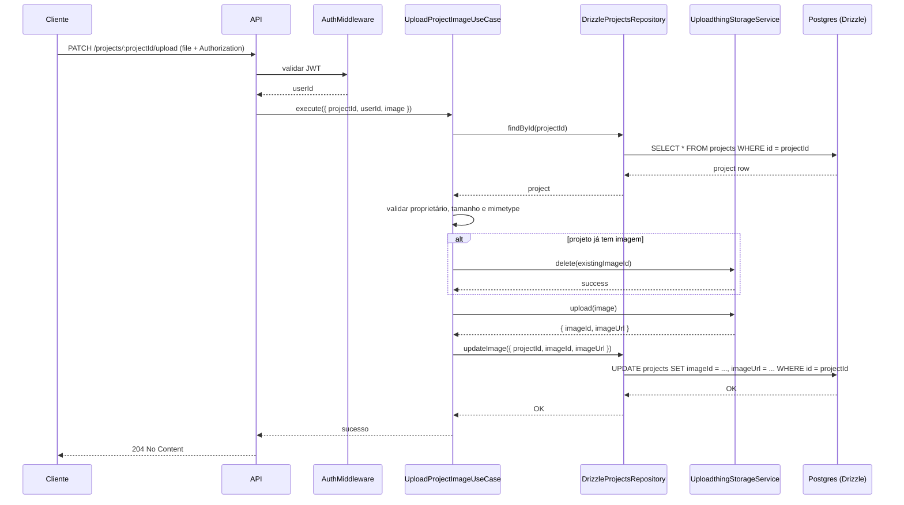

# Project Hub API

API backend para gerenciamento de projetos pessoais/portfolio. Este repositório contém uma API escrita em TypeScript que segue princípios de Clean Architecture, Domain-Driven Design (DDD) e os princípios SOLID. A API fornece autenticação via GitHub OAuth, operações CRUD para projetos, upload de imagens e persistência em PostgreSQL usando Drizzle.

## Sumário

- Visão geral
- Arquitetura (Clean Architecture)
- SOLID e DDD no projeto
- Funcionalidades
- Tecnologias utilizadas
- Diagrama do fluxo principal
- Como executar a aplicação (guia rápido)

---

## Visão geral

O objetivo desta API é servir como backend para um pequeno sistema de gerenciamento de projetos (por exemplo, um portfólio). Os usuários se autenticam via GitHub OAuth, podem criar/editar/excluir projetos, e fazer upload de imagens associadas aos projetos. A aplicação foi organizada para ser testável, modular e fácil de manter.

## Arquitetura

O projeto segue os princípios da Clean Architecture (arquitetura em camadas), com separação clara entre:

- Domain (entidades e regras de negócio): `src/domain/enterprise` e `src/domain/application`.
- Use-cases (casos de uso): código orquestrador que implementa as regras de aplicação (ex.: `authenticate-with-github`, `create-project`).
- Interfaces/Repositories (contratos): definem como a camada de domínio se comunica com infra (ex.: `projects-repository.ts`, `users-repository.ts`).
- Infraestrutura (implementações concretas): banco de dados (Drizzle/Postgres), serviços HTTP, serviços externos (GitHub OAuth, storage), middlewares e rotas em `src/infra`.
- Entry points (API HTTP): rotas e handlers que expõem os casos de uso.

Essa separação mantém dependências apontando para dentro (camadas externas dependem de contratos das camadas internas), o que facilita testes e substituição de implementações.

## SOLID e DDD aplicados

- Single Responsibility (SRP): cada caso de uso tem uma única responsabilidade (por exemplo, `create-project.ts` trata apenas da lógica de criação de projeto). Repositórios têm responsabilidade única de persistência.
- Open/Closed (OCP): comportamentos podem ser estendidos através de novas implementações de interfaces (por exemplo, trocar a implementação de storage ou oauth-service) sem modificar o domínio.
- Liskov Substitution (LSP): as implementações concretas de repositórios e serviços seguem os contratos definidos, podendo ser substituídas por versões de teste (in-memory) sem quebrar os casos de uso — veja `test/repositories` e `test/services`.
- Interface Segregation (ISP): contratos/repositórios são focados nas operações necessárias (por exemplo, separar métodos de busca, criação e atualização quando apropriado).
- Dependency Inversion (DIP): camadas superiores (domínio/use-cases) dependem de abstrações (interfaces) em vez de implementações; a infra implementa essas interfaces.

DDD (Domain-Driven Design):

- Entidades importantes (por exemplo, `User` e `Project`) estão no domínio (`src/domain/enterprise/entities`).
- Regras de negócio e invariantes são aplicadas no domínio e nos casos de uso.

## Funcionalidades

- Autenticação via GitHub OAuth. O fluxo troca o código do OAuth por dados do usuário e emite um JWT.
- CRUD completo para projetos: criar, listar (por usuário), atualizar e deletar projetos.
- Rotas de listagem: `GET /projects` (projetos do usuário autenticado) e `GET /users/:username/projects` (projetos de um usuário  que possui perfil público e/ou quando o usuário conectou o seu portfólio pessoal na aplicação).
- Upload de imagens associadas a projetos.
- Conexão do portfólio pessoal através de um token que autoriza requisições do domínio do portfólio ao endpoint público de projetos.
- Alternar status do perfil (público / privado).
- Obter contagens e limites (metadados) sobre os projetos e storage (por exemplo, quantidade de projetos e total de armazenamento permitido).

## Tecnologias

- Node.js + TypeScript (Core)
- Fastify (HTTP framework)
- Drizzle (ORM/Query builder)
- PostgreSQL (Database)
- Vitest (Test)
- pnpm (Package Manager)
- Docker / docker-compose para dependências (ex.: PostgreSQL)

---

## Diagrama do fluxo para upload de imagem

O diagrama abaixo mostra o fluxo do caso de uso "fazer upload de imagem de um projeto". Ele segue a sequência real implementada em `src/domain/application/use-cases/upload-project-image.ts` e nas integrações em `src/infra`.



Observação: o Use Case (`UploadProjectImageUseCase`) orquestra as chamadas ao repositório e ao serviço de storage. Se já existir uma imagem, o caso de uso requisita sua remoção antes de fazer o upload da nova. Em caso de falhas no serviço de storage, o código lança `BadGatewayError`; se o projeto não for encontrado ou se o usuário não for o proprietário do projeto, são lançados `NotFoundError` ou `ForbiddenError`, respectivamente.

---

## Guia: Como rodar a aplicação

1) Pré-requisitos

- Node.js (versão LTS recomendada)
- Docker e Docker Compose (para rodar PostgreSQL localmente)
- pnpm - package manager (opcional)

2) Variáveis de ambiente

Crie um arquivo `.env` na raiz, copie e cole as variáveis do arquivo `.env.example` e as preencha com os dados necessários.

3) Subir o banco de dados localmente (Docker Compose)

O projeto inclui `docker-compose.yml` com serviço Postgres. Para iniciar:

```bash
docker-compose up -d
```

Verifique se o Postgres está disponível na porta 5432.

4) Instalar dependências

```bash
pnpm install
```

5) Rodar migrações (se aplicável)

```bash
pnpm run db:migrate
```

6) Executar testes

```bash
pnpm run test
```

7) Rodar em modo de desenvolvimento

```bash
pnpm run dev
```

---